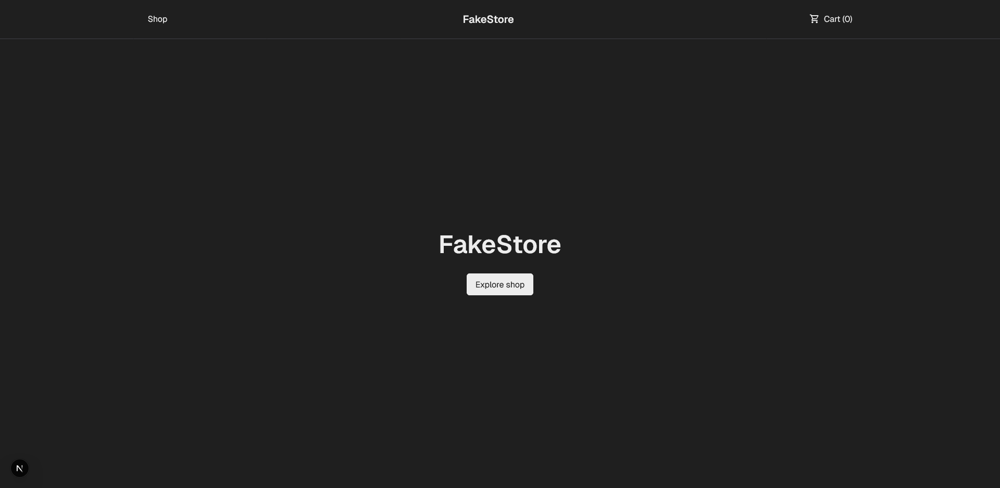
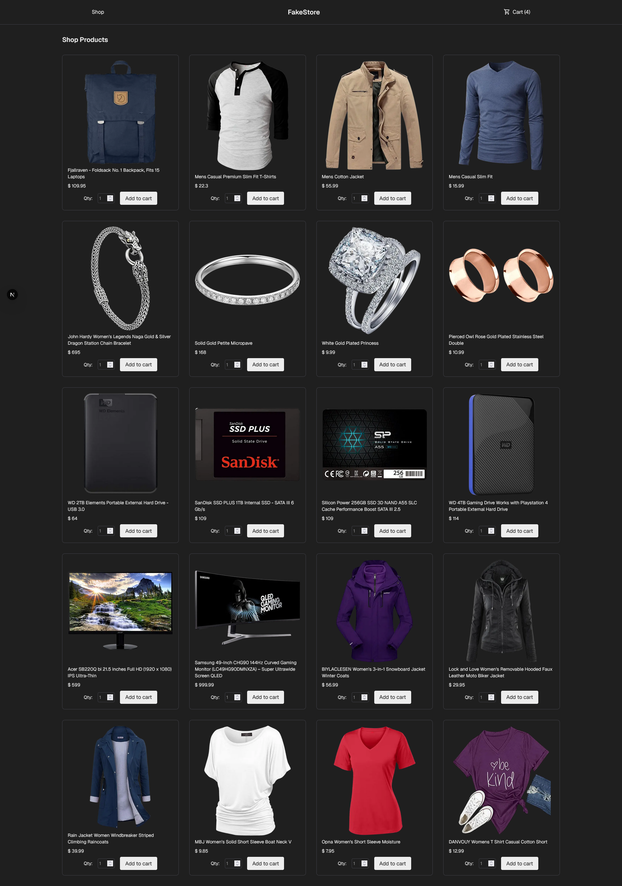
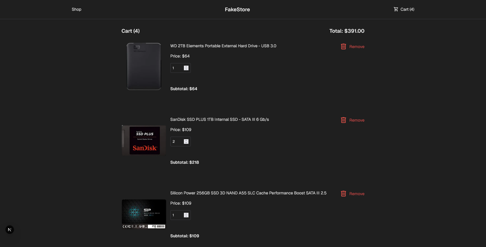

# CV Generator
This simple web application is a typical ecommerce shop where users can add items to a cart and view the items in their cart before checkout.

By building this project, I learned how to manage layouts and pages with NextJS to create a single page application. I also leveraged the ContextAPI feature of React to manage shared cart state across multiple components on different pages. The products are also fetched through the [Fake Store API](https://fakestoreapi.com/).

## Preview
### Home Page

### Shop Page

### Cart Page

## Credits
- Project Idea Credit: The Odin Project
